# OpenTinyHome
A repository for free-and-open-source **tiny-house blueprints** in the form of complete and fully detailed **3D-models** that only contain **realistic dimensions** for building materials, and striving to comply with best building practices.

## The Motivation
The intent with this project is to enable anyone to build a reliable and up-to-code home for themselves. This biggest hurdle is always acquiring a complete plan.

The undertaking of producing a solid plan by oneself requires either:
- Degrees in **carpentry**, **electrics**, **plumbing** and possibly **welding** (for trailers).
- A lifetime of practical **DIY experience** and know-how.
- Months of dedicated **research**.

Plans are available online, but none that are complete with utilities. Very often, they require experience in reading traditional 2D blueprints.

The plans that are available in this repository will assume (and therefore require) only one thing: The ability to read.

## The Roadmap
- [x] Establish a protocol for designing accurate 3D-models of homes in Sketchup.
- [ ] Produce a complete 3D model of a standard tiny house to serve as both the first available plan and as a reference for other future plans that may be produced by anyone wanting to contribute.
- [ ] Produce a LEGO-like instruction manual that detail every step of building the reference tiny house.

## Design Constraints
Every home design that will be hosted here must adhere to the following design constraints:
- Buildable with only standard materials and hand tools.
- Well-insulated construction with thick walls and roof.
- Roof surfaces that support installing photovoltaic panels at an angle.
- Design must include plans for utilities, i.e. electrics, water and heat.

## The Reference
A reference tiny house blueprint designed **only to be a reference plan** for others that wish to contribute with their own plans. It serves to illustrate the idea of building the model as one would a real house, i.e. using discrete units of timber, as well as how to organize the plan using tags. [Model](the_reference/model.skp) | [Materials](the_reference/materials.ods)

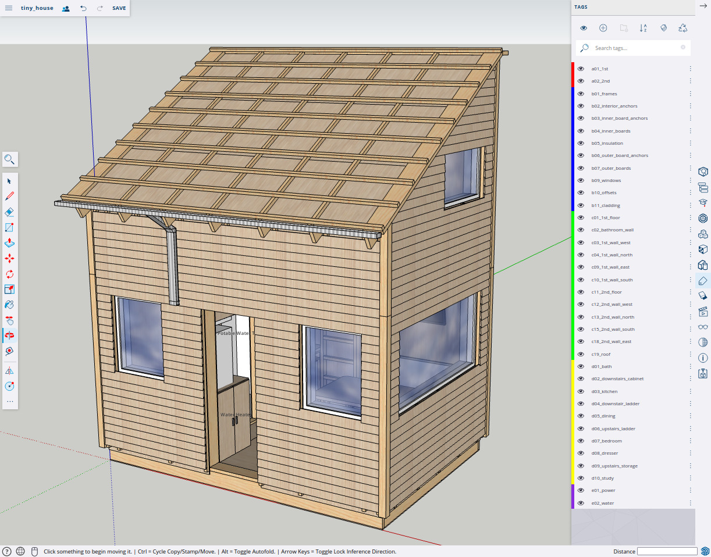
<table>
    <tr>
        <td>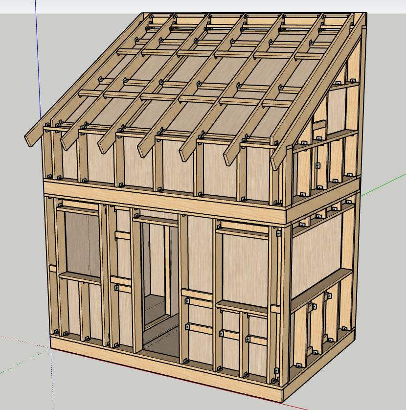</td>
        <td></td>
    </tr>
    <tr>
        <td>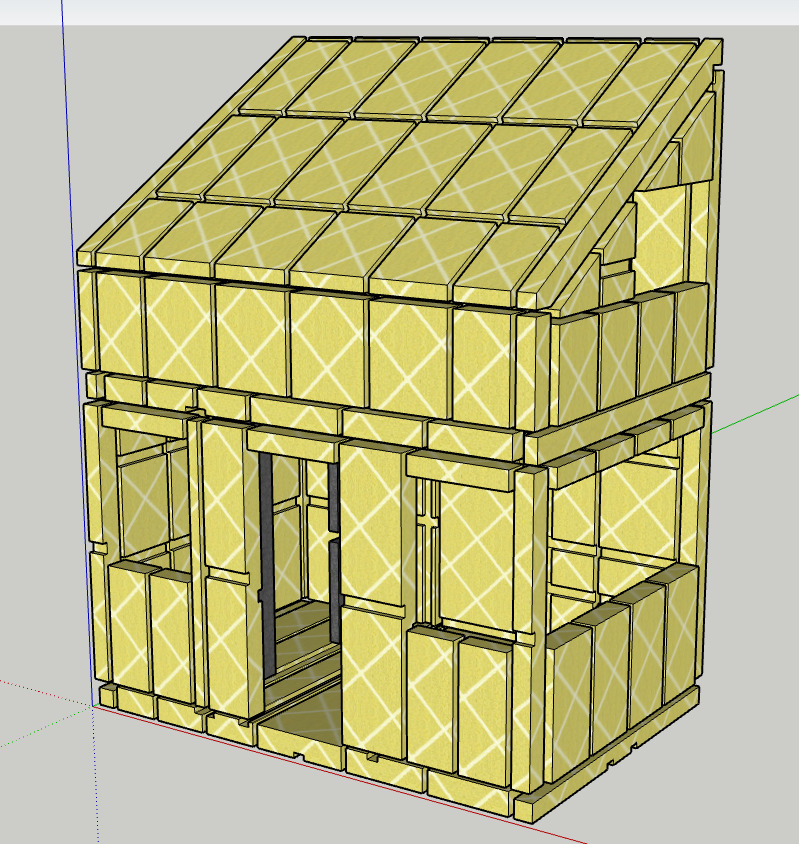</td>
        <td></td>
    </tr>
    <tr>
        <td>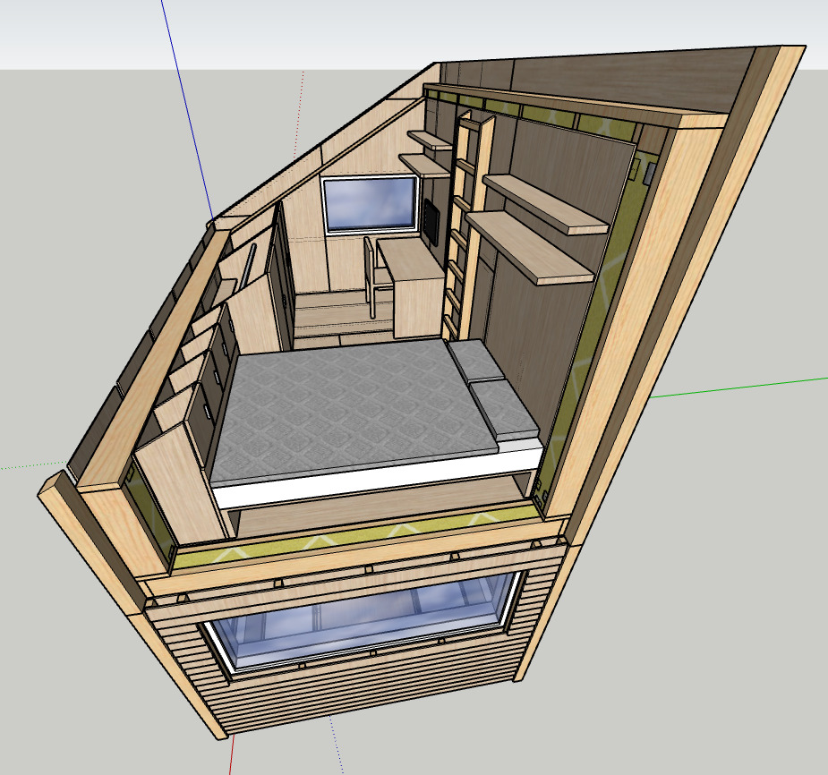</td>
        <td>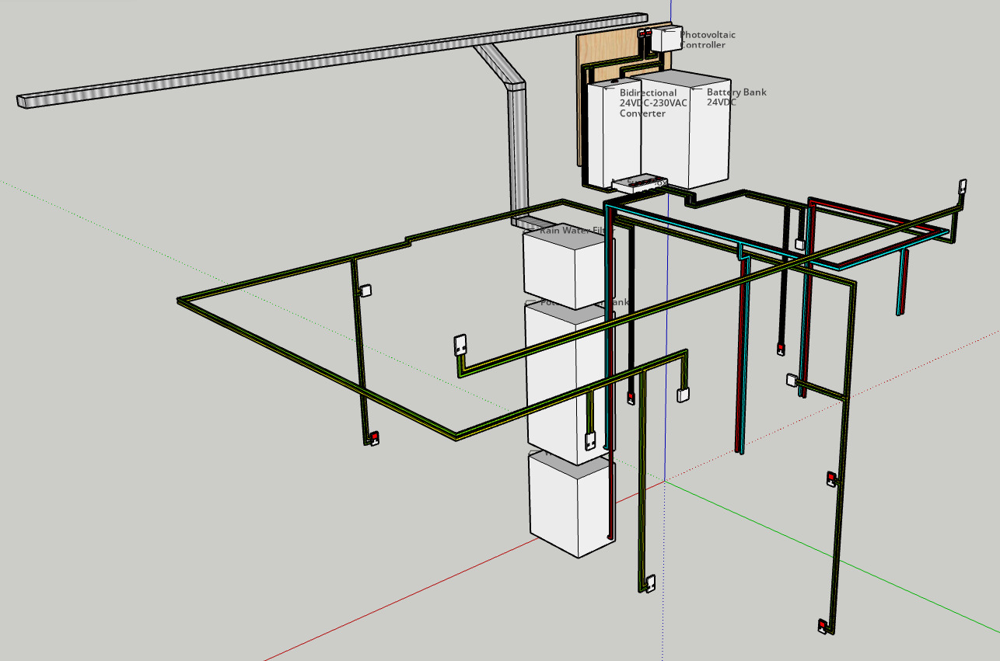</td>
    </tr>
</table>

## The Nano (WIP)
The tiny house that I plan to build for myself. This model will be fully detailed and also published as a PDF step-by-step guide, once finished.

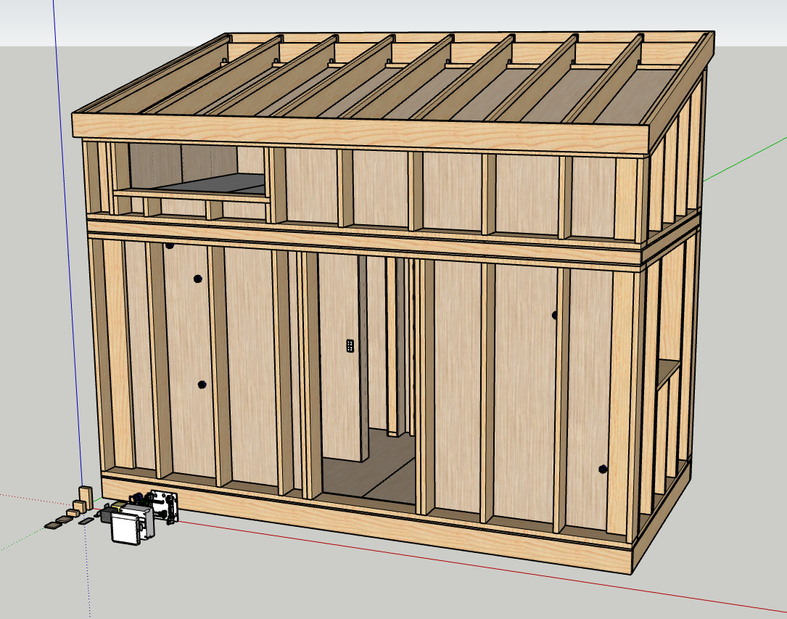
<table>
    <tr>
        <td></td>
        <td>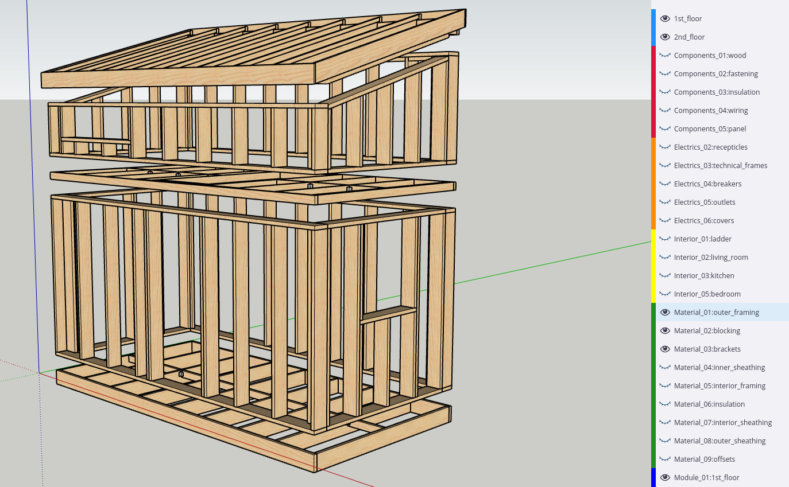</td>
    </tr>
    <tr>
        <td>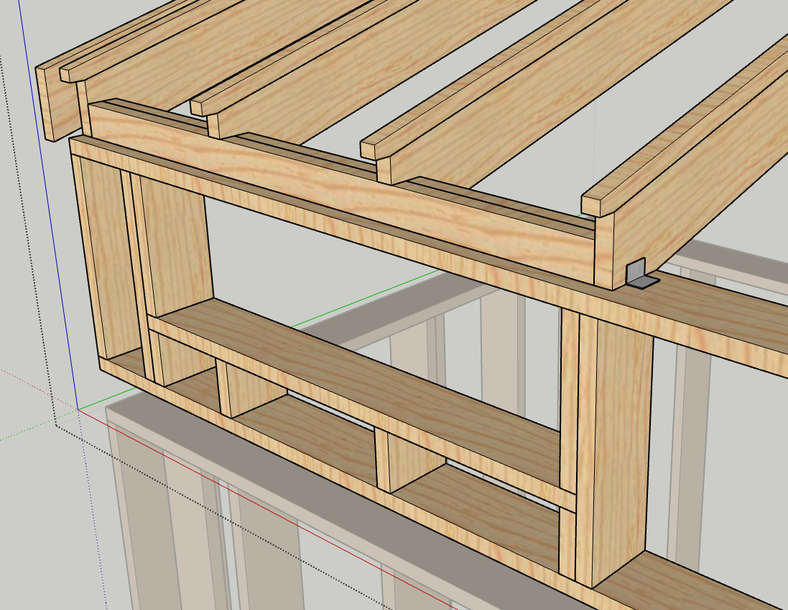</td>
        <td>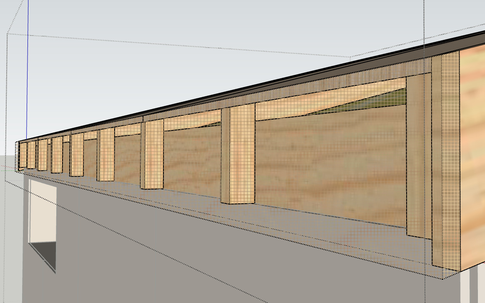</td>
    </tr>
    <tr>
        <td>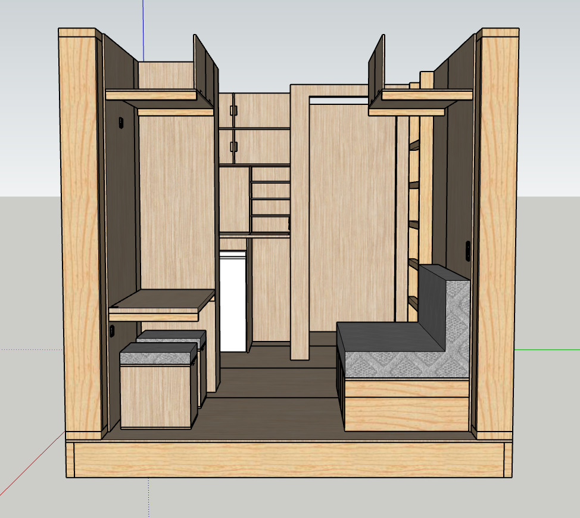</td>
        <td>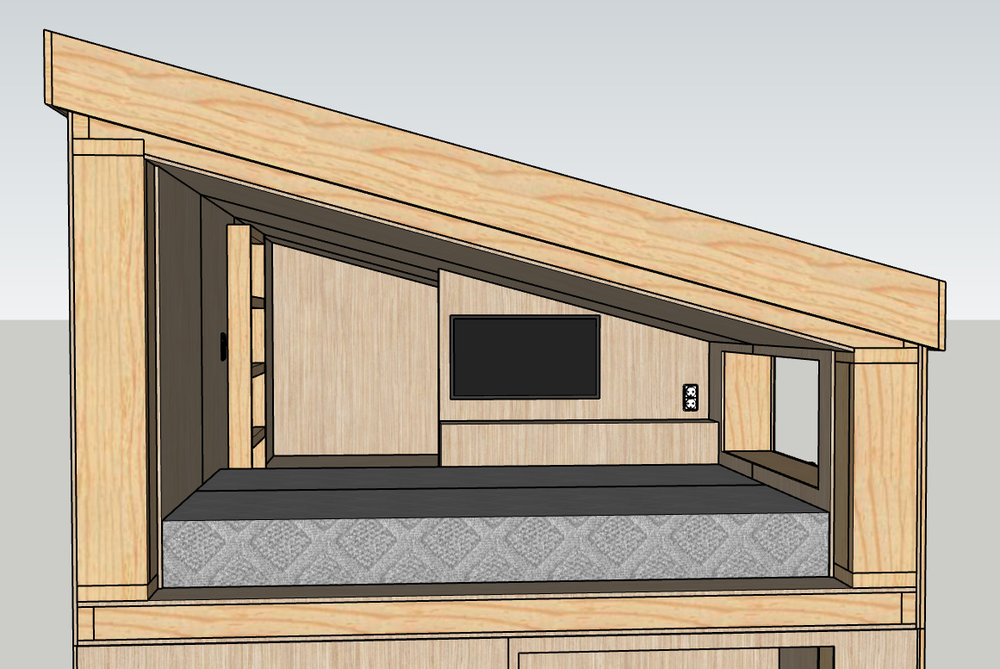</td>
    </tr>
</table>
