# OpenTinyHome
A repository for free-and-open-source **home blueprints** in the form of complete and fully detailed **3D-models** comprised of only readily available components that strive to comply with best building practices.

<table>
    <tr>
        <td>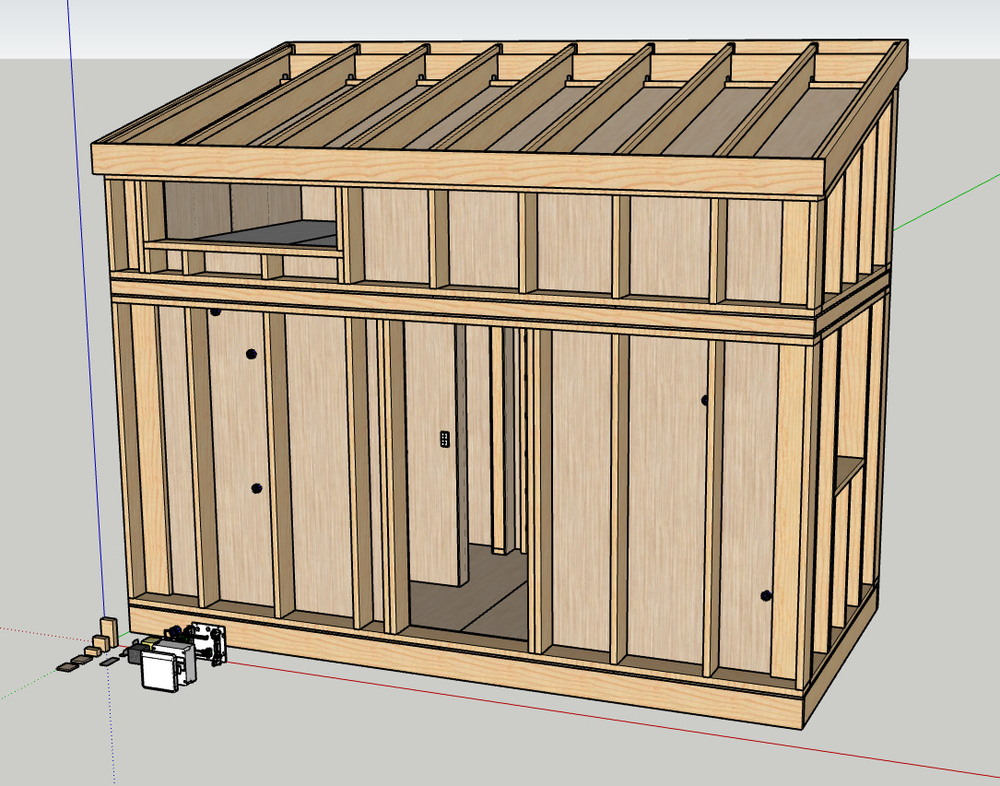</td>
        <td>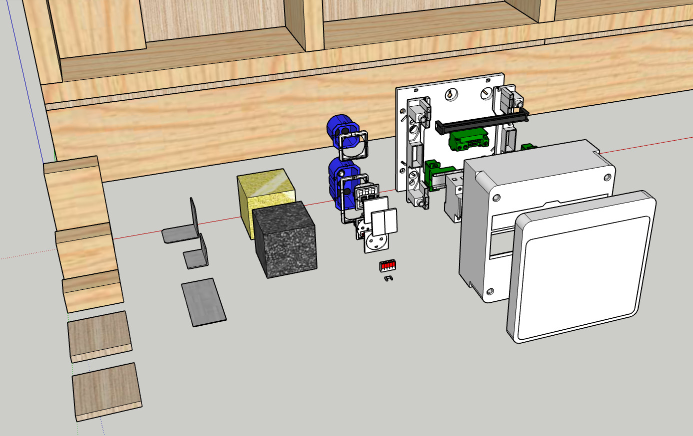</td>
        <td></td>
    </tr>
</table>

## Motivation
The intent with this repository is to enable anyone to design and/or build a reliable and up-to-code home for themselves. Traditionally, this requires either:
- Degrees in **carpentry**, **electrics**, **plumbing** and possibly **welding**.
- A lifetime of practical **DIY experience** and know-how.
- Many months of dedicated **research**.

Other plans are available online, but none that are complete with utilities, and the vast majority assumes the reader to be an experienced builder. **Plans in this repository assume no prior knowledge**.

## Roadmap
- [x] Produce a `reference` model in Sketchup as a *proof-of-value* of pre-modelling.
- [ ] Produce `bases` model files with the most commonly used construction components.
- [ ] Produce `concepts` model files that serve as an interactive building concepts illustrator.
- [ ] Produce `checklists` for designing *up-to-code* and *best-practices-compliant* homes.
- [ ] Establish a `protocol` for translating 3D models into step-by-step instruction manuals.
- [ ] Localization of everything to fit EU and US standards and build codes.

The ideal end-goal is to host community-made construction plans in this repository, not necessarily limited to *tiny houses*.

Shortcuts: [Reference](#reference) | [Base](#base) | [Concepts](#concepts) | [Checklist](#checklist) | [Protocol](#protocol) | [Showcase](#showcase) | [Contribute](#contribute)

## The Reference Model 
This is a model designed **only to be a reference plan** for others that wish to contribute with their own plans. It serves to illustrate the idea of building a complete model as one would a real house, i.e. using discrete units of timber, fasteners, etc. It also serves to demonstrate how to organize the model using tags. [Model](reference/model.skp) | [Materials](reference/materials.ods)

<b>More reference model images</b>

<table>
    <tr>
        <td>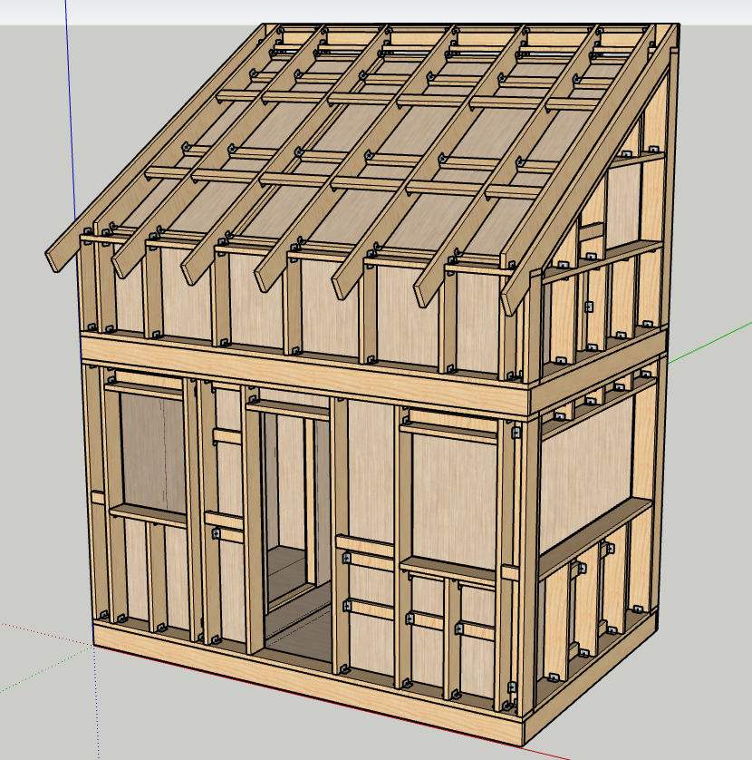
        Framing and inner sheathing.</td>
        <td>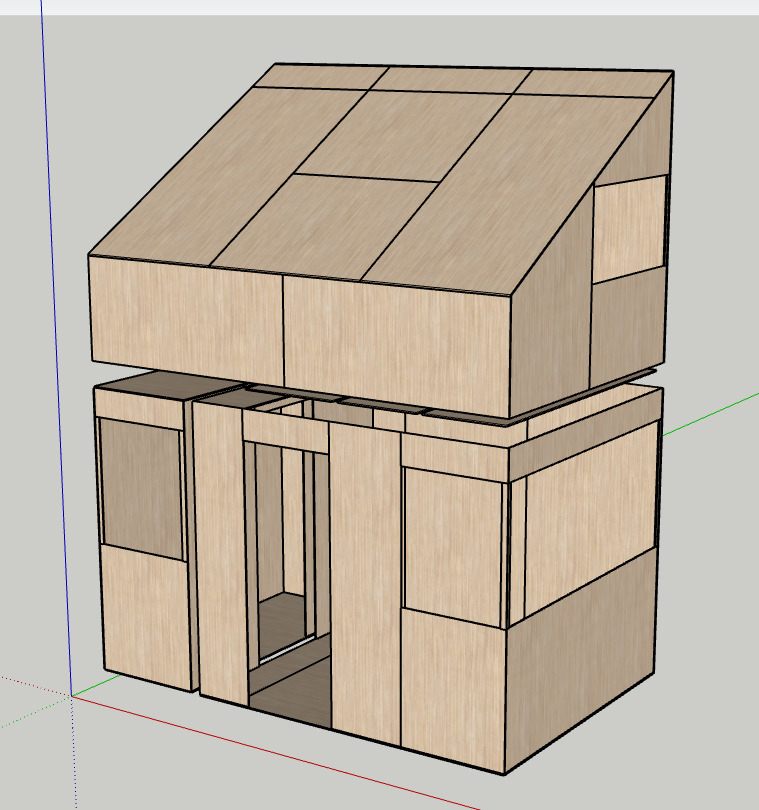
        Outer sheathing.</td>
    </tr>
    <tr>
        <td>
        Thermal control layer (insulation).</td>
        <td>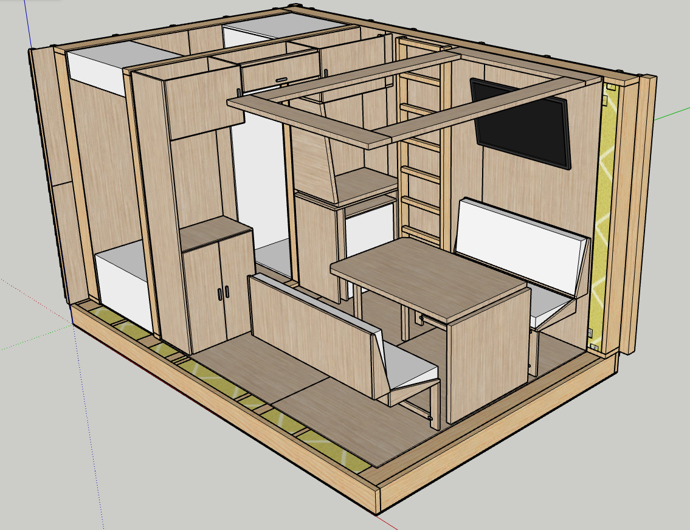
        The 1st floor internal layout.</td>
    </tr>
    <tr>
        <td>
        The 2nd floor internal layout.</td>
        <td>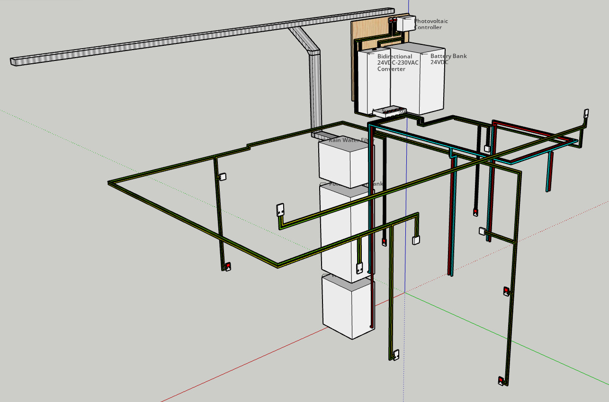
        Basic layouting of utilities.</td>
    </tr>
</table>

## Base (WIP) 
Standard Sketchup files that includes components from which realistic homes can be modelled. These files will be in continuous development. The first base file will use the metric system and standard components available in Denmark (where I live).

| File | Preview |
| ---- | ------- |
| [Base-DK](bases/images/base_dk.png) includes Lauritz Knudsen (Scheider Electrics) basic components. Plumbing components and other commonly used building materials are coming, including commercially available solar panel systems.  | 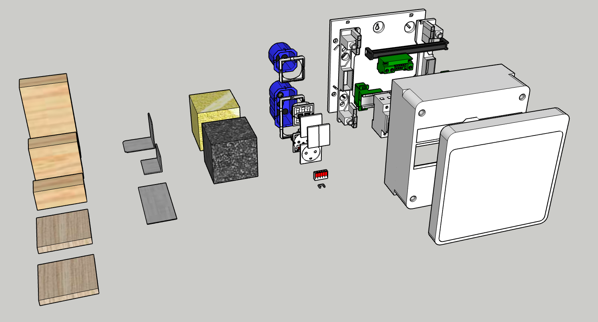 |

<b>Future Readme Sections</b>

## Checklist 
A continuously evolving checklist for designing and building homes that follow best-practices and contain tip-and-tricks for practical building.

## Concepts
Standard Sketchup files that serve to illustrate established building principles, e.g. how to vent a roof, how to space sheathing and siding, framing anatomy, etc. using interactive 3D *minimum-working-example*-style models.

## Protocol 
A protocol for converting 3D models into PDF step-by-step plans. Ideally, it will be automated by feeding correctly tagged Sketchup files into a python script that generates the PDF as a LEGO-style build guide.

## Showcase 
The place where popular models and their build plans are displayed.

<b>Expand</b>

### The Nano (WIP)
The tiny house that I plan to build for myself. This model will be fully detailed and also published as a PDF step-by-step guide, once finished.

<table>
    <tr>
        <td></td>
        <td></td>
    </tr>
    <tr>
        <td>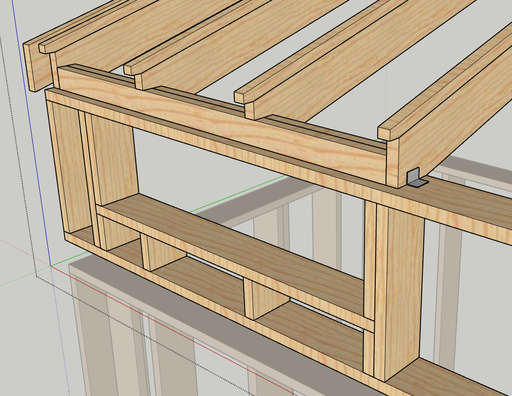</td>
        <td>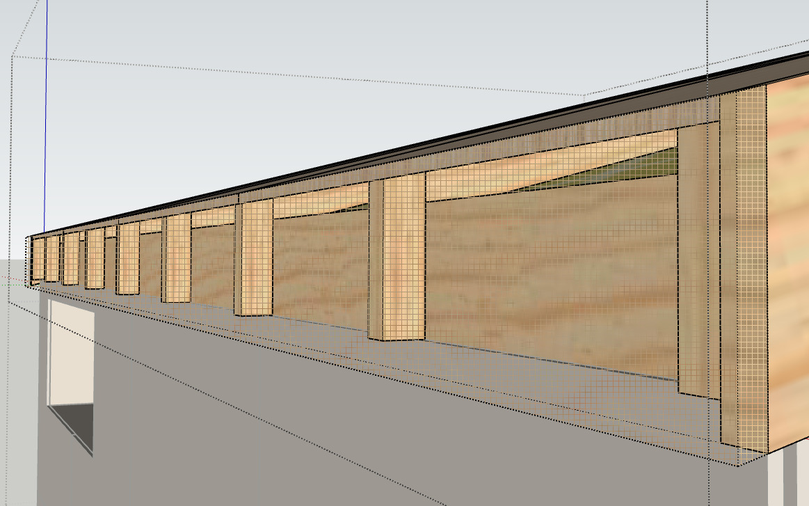</td>
    </tr>
    <tr>
        <td>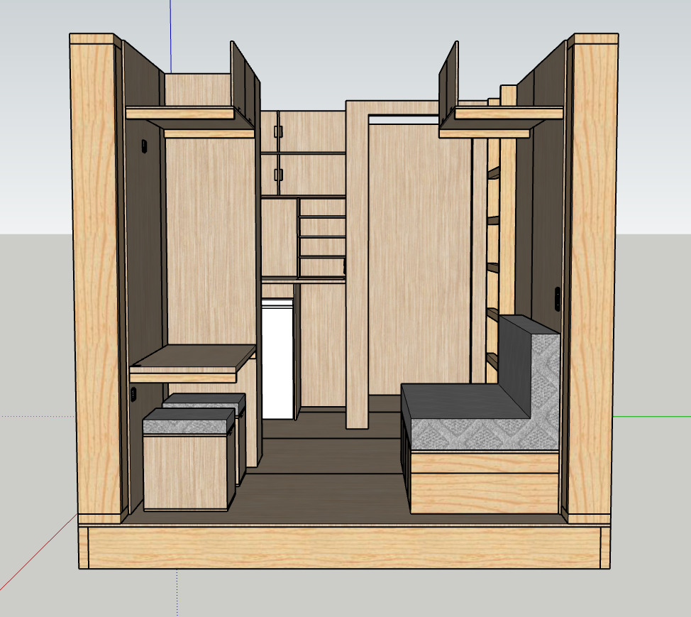</td>
        <td>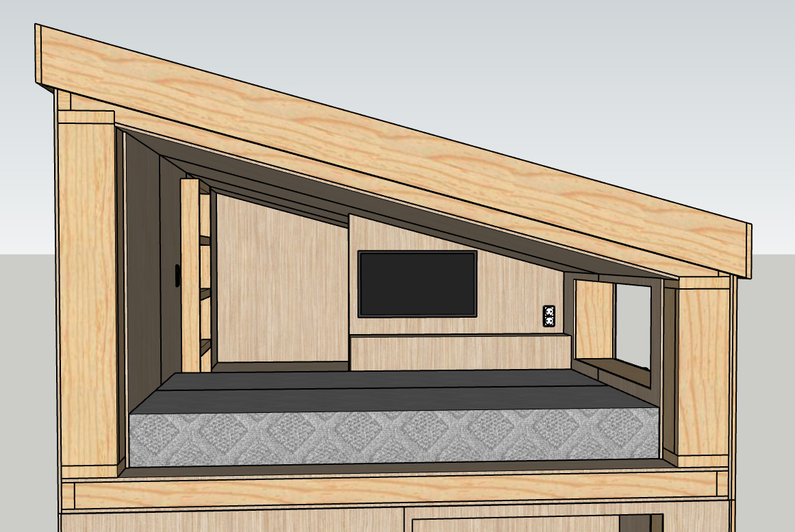</td>
    </tr>
</table>

## Contribute
You can contribute in the following ways:
- Fork a base and localize it to the commercial standards of your area.
- Use an existing base to create full house models.
- Review existing models, opening issues, compiling material lists, etc.
- Modify existing models.

All contributions are accepted through pull-requests.
