#  Scaffold

An **open standard** for designing and optimizing plans for real-world homes.
<table><tr>
    <td>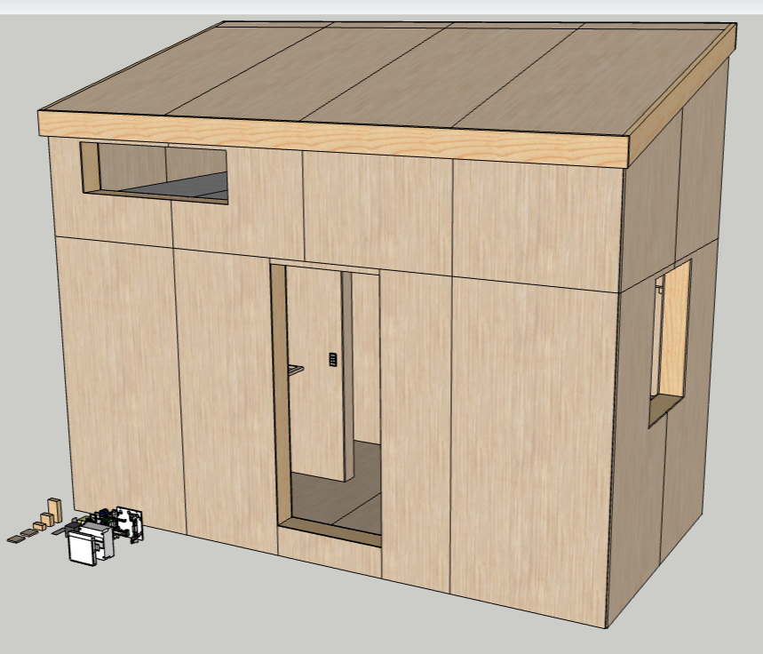</td>
    <td></td>
    <td></td>
    <td>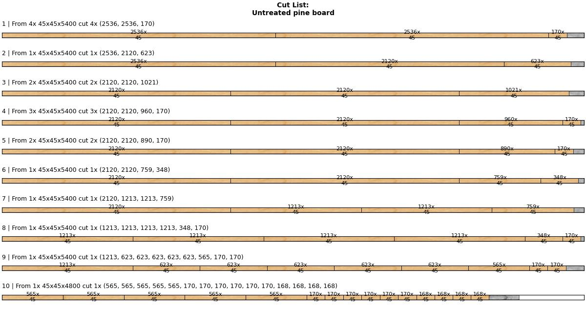</td>
</tr></table>

**Purpose**: *To provide anyone with the necessary knowledge to build their own home.*
Concretely, the intent with Scaffold is the following:
1. To define an open **standard** for designing homes in 3D-modelling software.
2. To provide localized collections of pre-modelled **3D components**.
3. To offer digital tools for construction **planning** and material **optimization**.
4. To act as a hub for **sharing** home designs.
5. To establish a **knowledge base** for home building.

Scaffold is primarily intended for *tiny-house* homes, but scales to projects of any size.

<details><summary><b>Read more about the motivation of this project</b></summary>

> The barrier-of-entry for building a home is incredibly high. Traditionally, to design and build a home that is up-to-code and suitable for year-round dwelling, one needs degrees in **carpentry**, **electrics** and **plumbing**, or a lifetime of practical **DIY experience** and solid know-how. In any case, many months of dedicated research is unavoidable.
>
> Couple these facts with the absolutely ludicrous state of the global housing market, the prospect of ever owning one's own home becomes vanishingly small.
>
> To provide a competitive alternative to the housing market, the barrier-of-entry for home building must be lowered all the way to the ground floor. This project aims to do this through providing complete, step-by-step home blueprints that assumes no prior knowledge on part of the reader.

</details>

---
**Shortcuts**: [Workflow](#workflow) | [3D-Modelling](#3d_modelling) | [Component Lists](#component_lists) | [Scaffold.py](#scaffold_lib) | [Showcase](#showcase) | [Contribute](#contribute)

---


## Workflow<a name="workflow"></a>
For the ones interested in designing their own home using this repository, the recommended workflow is as follows:

1. Build a **3D model** of your home using the components in a starter file.
2. Use the model to compile a **components list** in the specified csv format.
3. Find or compile a **stock list** that applies to the area in which you live.
4. Use the **scaffold** library to generate shopping lists, cutting diagrams and estimates.

For anyone interested in building a home that has already been designed, simply browse the [showcase](#showcase) section and download a blueprint.

---
### 3D-Modelling<a name="3d_modelling"></a>
> Why invest time into modelling my entire home?

There are **numerous advantages** to modelling your home digitally before ever starting to the build process. These are but a few:

- When you have a model, iterating on ideas and making changes is extremely simple and will cost nothing. You are free to try out different layouts, materials and sizes.
- Communicating your ideas to others that will be involved in the build process becomes as simple as showing them the model. The risk of misunderstandings is reduced to near-zero.
- With a finished model, you will have every single length and angle measurement beforehand. Using the provided tools, you can plan every single cut before ever touching a saw. This allows you to optimize both the build process and material utiliization, reducing both the impact on the environment and your wallet.
- The advantages that are listed above will make obtaining planning permissions much more feasible.

**Modelling Software**:\
Any modelling tool capable of assigning geometry into **components**, **groups**, and assigning **tags**, is suitable for home modelling. **SketchUp** is very good option, as it is extremely intuitive and available online, free-of-charge (though not FOSS).

#### Model Structure
The recommended structuring of models is illustrated below with an example:

```
My_home
    module_01:1st_floor
        assembly_01:floor
            board_45_195_2120
            sheet_12_1220_2440
            insulation_195_565_2120
            ...
        assembly_02:north_wall
            board_45_195_2120
            window_20_1000_1000
            outlet
            ...
        ...
    module_02:2nd_floor
        assembly_03:east_gable
            ...
        ...
    module_03:roof
        ...
    ...
```

- A **module** is a group of **assemblies**. An **assembly** is a group of **components**. Modules and assemblies should be tagged as `module_xx:name` and `assembly_xx:name`.
- A **component** is a basic building block, and should be be tagged with their category, e.g. a `category_xx:board` and `category:sheathing`.
- Variable-size components like boards and sheets should include dimensions in their name, e.g. `board_thickness_width_length`.
- A component can be made up of other components, e.g. several electrical switch types share standard components like fastening.

**Note**: Component models need only be as complex as is needed to convey structure and function.


#### Starters <a name="starters"></a>
Starters are files that includes components from which fully realistic homes can be modelled. Starters will be in continuous development. The first starter will be a SketchUp file that uses the metric system and standard components available in Denmark (use this as a reference for how to structure other starters).

**Naming**: `starter_[country_code]_[unit_system].[file_extension]`.

| File | Preview |
| ---- | ------- |
| [starter_dk_metric.skp](starters/starter_dk_metric.skp) includes Lauritz Knudsen (Scheider Electrics) basic components. Plumbing components and other commonly used building materials are coming, including commercially available solar panel systems.  |  |

---
### Component Lists<a name="component_lists"></a>
To take full advantage of having a model of our projects, we must extract data from it. Once a model has been completed, we use it to compile a list of required components as a `csv` file.

Below is an explanation of such a "`components.csv`" file.

<details><summary><b>Components.csv</b></summary>

Header:`category;material;module;assembly;uses;count;thickness;width;length;slope;var_dims`

| Columns     | Explanation                                                                            |
| :---------- | :------------------------------------------------------------------------------------- |
| `category`  | Arbitrary category description, e.g. `board`, `sheathing`, `insulation`, etc.          |
| `material`  | Arbitrary material description, e.g. `untreated pine`, `galvanized steel`, etc.        |
| `module`    | Location in structure, e.g. `1st floor`, `2nd floor`, `attic` etc.                     |
| `assembly`  | Location in module, e.g. `floor`, `north wall`, `inner wall`, etc.                     |
| `uses`      | What component is used for, e.g. `joist`, `stud`, `inner sheathing`, etc.              |
| `count`     | Simply the number of identical components to avoid repeating lines                     |
| `thickness` | Typically the shortest dimension of the component.                                     |
| `width`     | Typically the second shortest dimension of the component.                              |
| `length`    | Typically the longest dimension of the component.                                      |
| `slope`     | The angle of the cut into the stock to produce this component                          |
| `var_dims`  | The number of variable dimensions of the stock, e.g. boards have `1`, sheets have `2`. |

</details><br>

To take advantage of this components list, we also need a list of commercially available (off-the-shelf) stock components, e.g. lumber of standardized dimensions, etc. since it is not possible to purchase construction components with specific dimensions.

Below is the explanation of the structure of such a "`stock.csv`" file.

<details><summary><b>Stock.csv</b></summary>

Header:`category;material;thickness;width;length;count;unit_cost;norm_cost;density;retailer;load;var_dims`

| Columns     | Explanation                                                                        |
| :---------- | :--------------------------------------------------------------------------------- |
| `category`  | Arbitrary category description, e.g. `board`, `sheathing`, `insulation`, etc.      |
| `material`  | Arbitrary material description, e.g. `untreated pine`, `galvanized steel`, etc.    |
| `count`     | Simply the number of identical components to avoid repeating lines                 |
| `thickness` | Typically the shortest dimension of the component.                                 |
| `width`     | Typically the second shortest dimension of the component.                          |
| `length`    | Typically the longest dimension of the component.                                  |
| `count`     | The count of individual components in one unit, e.g. 20-pack nails.                |
| `unit_cost` | The cost of one of these stock items/packs.                                        |
| `norm_cost` | The normalized cost, e.g. `eur/m`, `usd/m^2`, etc.                                 |
| `density`   | The mass per volume, e.g. `kg/m^3`.                                                |
| `retailer`  | Where the entry data is from, i.e. where this stock can be bought.                 |
| `load`      | Whether the stock is rated for load-bearing, `0` for no, `1` for yes.              |
| `var_dims`  | The number of variable dimensions of the stock, e.g. boards have `1`, sheets have `2`. |

The components and stock files can have any name, but the stock-file's name is encouraged to follow the pattern `[localization]_[unit-system]_[...].csv`, e.g. `dk_metric.csv` or `us_imperial.csv`, such that they can be shared.

</details><br>

**Note**:
- The names of the csv files are irrelevant to the program.
- Columns are semicolon-separated by default, but is settable using the `sep=` parameter.
- The order of the columns is irrelevant to the program, but the shown order is encouraged.
- Blank lines and `# comments` are ignored by the program, so can be used to increase readability.
- The `var_dims` number determines the dimensionality of the applied packing algorithm.

---
### The Scaffold Library <a name="scaffold_lib"></a>
Using the `components.csv` and `stock.csv` files together with the `Scaffold` python library, we can generate **stock shopping lists**, **cutting diagrams** and extremely accurate estimates of **costs**, **volumes** and **masses** of constructions, both in total and for individual modules, assemblies, categories and any combinations thereof.

```python
# Import the Plan class from the scaffold library.
from scaffold import Plan
```

```python
# Load in components and available stock.
plan = Plan("path/to/components.csv", "path/to/stock.csv")
```
<details><summary>Input example</summary>

components.csv
```csv
category;material;module;assembly;uses;count;thickness;width;length;slope;var_dims

# Boards.
board;untreated pine;base;floor;rim joist;2;45;195;4880;0;1
board;untreated pine;base;floor;joist;9;45;195;2350;0;1
board;untreated pine;base;floor;blocking;6;45;95;565;0;1
board;untreated pine;base;floor;blocking;2;45;95;542.5;0;1

board;untreated pine;base;north wall;wall plate;2;45;195;4880;0;1
board;untreated pine;base;north wall;full stud;4;45;195;2120;0;1
...

# Inner sheathing.
sheathing;plywood;base;floor;inner sheathing;4;15;1220;2440;0;2

sheathing;plywood;base;north wall;inner sheathing;2;12;1220;2210;0;2
sheathing;plywood;base;north wall;inner sheathing;2;12;1025;2210;0;2

sheathing;plywood;base;south wall;inner sheathing;2;12;1025;2210;0;2
sheathing;plywood;base;south wall;inner sheathing;1;12;907;2210;0;2
...

# Outer sheathing.
sheathing;plywood;base;north wall;outer sheathing;4;12;1220;2420;0;2

sheathing;plywood;base;south wall;outer sheathing;2;12;1220;2420;0;2
sheathing;plywood;base;south wall;outer sheathing;1;12;907;2420;0;2
...
```

stock.csv
```csv
category;material;thickness;width;length;count;unit_cost;norm_cost;density;retailer;load;var_dims

# Boards
board;untreated pine;45;45;3000;1;29.25;9.75;450;jemogfix.dk;0;1
board;untreated pine;45;45;4200;1;33.39;7.95;450;lavpristrae.dk;0;1
board;untreated pine;45;45;4800;1;56.38;11.75;450;stark.dk;0;1
board;untreated pine;45;45;5100;1;59.90;11.75;450;stark.dk;0;1
board;untreated pine;45;45;5400;1;63.43;11.75;450;stark.dk;0;1

board;untreated pine;45;70;3000;1;54.95;18.31;450;stark.dk;1;1
board;untreated pine;45;70;3600;1;65.94;18.31;450;stark.dk;1;1
board;untreated pine;45;70;4200;1;76.93;18.31;450;stark.dk;1;1
board;untreated pine;45;70;4800;1;87.91;18.31;450;stark.dk;1;1
board;untreated pine;45;70;5100;1;93.41;18.31;450;stark.dk;1;1
board;untreated pine;45;70;5400;1;98.90;18.31;450;stark.dk;1;1

board;untreated pine;45;95;2400;1;33.48;13.95;450;lavpristrae.dk;0;1
board;untreated pine;45;95;2700;1;37.66;13.95;450;lavpristrae.dk;0;1
board;untreated pine;45;95;3000;1;41.85;13.95;450;lavpristrae.dk;0;1
board;untreated pine;45;95;3600;1;50.23;13.95;450;lavpristrae.dk;0;1
board;untreated pine;45;95;4200;1;58.59;13.95;450;lavpristrae.dk;0;1
board;untreated pine;45;95;4800;1;66.96;13.95;450;lavpristrae.dk;0;1
board;untreated pine;45;95;5100;1;89.50;17.55;450;stark.dk;0;1
board;untreated pine;45;95;5100;1;124.29;24.39;450;stark.dk;1;1
board;untreated pine;45;95;5400;1;94.78;17.55;450;stark.dk;0;1
board;untreated pine;45;95;5400;1;131.70;24.39;450;stark.dk;1;1

board;untreated pine;45;120;3600;1;75.42;20.95;450;lavpristrae.dk;1;1
board;untreated pine;45;120;4200;1;87.99;20.95;450;lavpristrae.dk;1;1
board;untreated pine;45;120;4800;1;100.56;20.95;450;lavpristrae.dk;1;1

board;untreated pine;45;145;3600;1;89.82;24.95;450;lavpristrae.dk;1;1
board;untreated pine;45;145;4200;1;104.80;24.95;450;lavpristrae.dk;1;1
board;untreated pine;45;145;4800;1;119.76;24.95;450;lavpristrae.dk;1;1
board;untreated pine;45;145;5400;1;134.73;24.95;450;lavpristrae.dk;1;1

board;untreated pine;45;195;3600;1;118.62;32.95;450;lavpristrae.dk;1;1
board;untreated pine;45;195;4200;1;138.39;32.95;450;lavpristrae.dk;1;1
board;untreated pine;45;195;4800;1;158.16;32.95;450;lavpristrae.dk;1;1
board;untreated pine;45;195;5400;1;177.93;32.95;450;lavpristrae.dk;1;1

board;untreated pine;45;245;3600;1;154.62;42.95;450;lavpristrae.dk;1;1
board;untreated pine;45;245;4200;1;180.39;42.95;450;lavpristrae.dk;1;1
board;untreated pine;45;245;4800;1;206.16;42.95;450;lavpristrae.dk;1;1
board;untreated pine;45;245;5400;1;231.93;42.95;450;lavpristrae.dk;1;1

board;untreated pine;45;295;3600;1;215.82;59.95;450;lavpristrae.dk;1;1
board;untreated pine;45;295;4200;1;287.76;59.95;450;lavpristrae.dk;1;1

# Sheathing
sheathing;plywood;9;1220;2440;1;249.00;0;460;jemogfix.dk;0;2
sheathing;plywood;12;1220;2440;1;299.00;0;460;jemogfix.dk;0;2
sheathing;plywood;12;1220;2440;1;289.00;0;460;jemogfix.dk;1;2
sheathing;plywood;15;1220;2440;1;349.00;0;460;jemogfix.dk;1;2

# Insulation
insulation;rigid mineral wool;95;600;960;10;169.00;29.34;37;jemogfix.dk;0;2
```

</details><br>


```python
# Optionally apply filters to the components and/or stock lists.
# Filters are standard Pandas queries.
plan.filter_components("module == 'base' and category == 'board'")
plan.filter_stock("length <= 4800")
```

```python
# Visualize all components.
components = plan.inspect(combine=True, sort=True, show=True)
```

<details><summary>Output example</summary>
    <table><tr style="vertical-align:top">
        <td>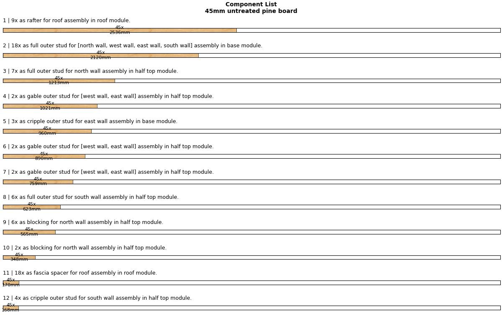</td>
        <td>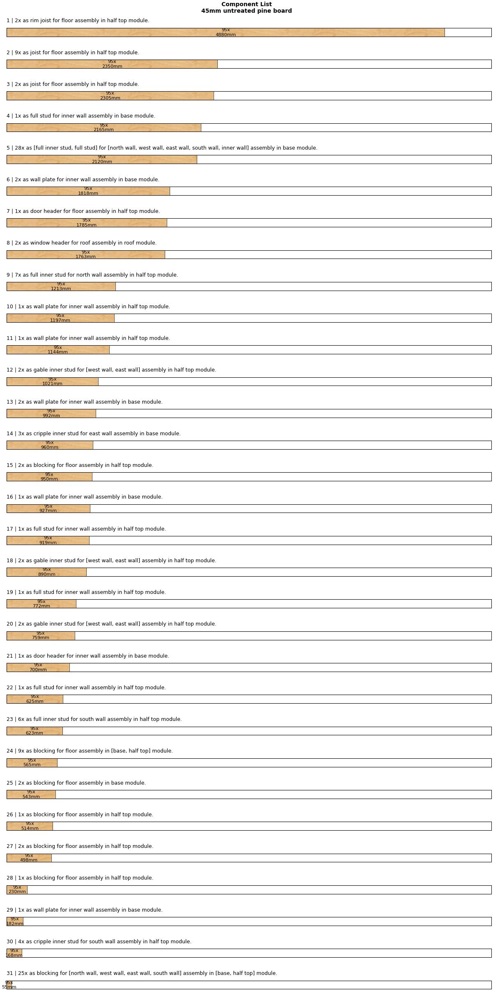</td>
        <td>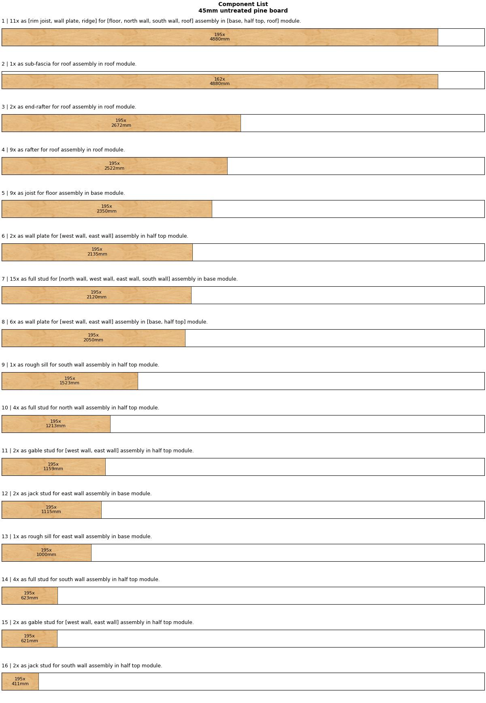</td>
    </tr><tr style="vertical-align:top">
        <td>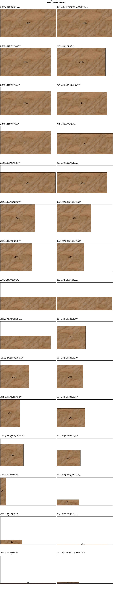</td>
        <td>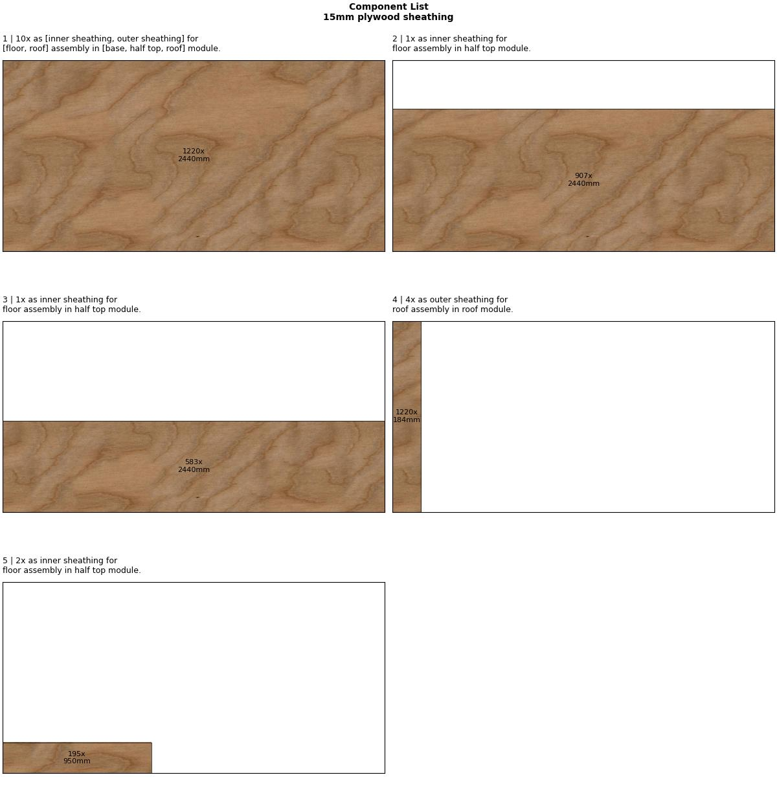</td>
        <td>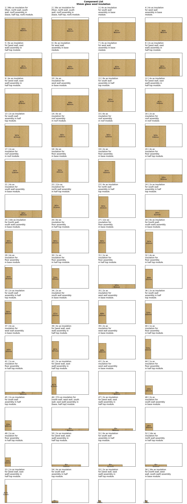</td>
    </tr></table>
</details><br>

```python
# Pack components into appropriate stock.
packings = plan.pack(show=True, cut_thickness=1)
```

<details><summary>Output example</summary>
    <table><tr style="vertical-align:top">
        <td></td>
        <td>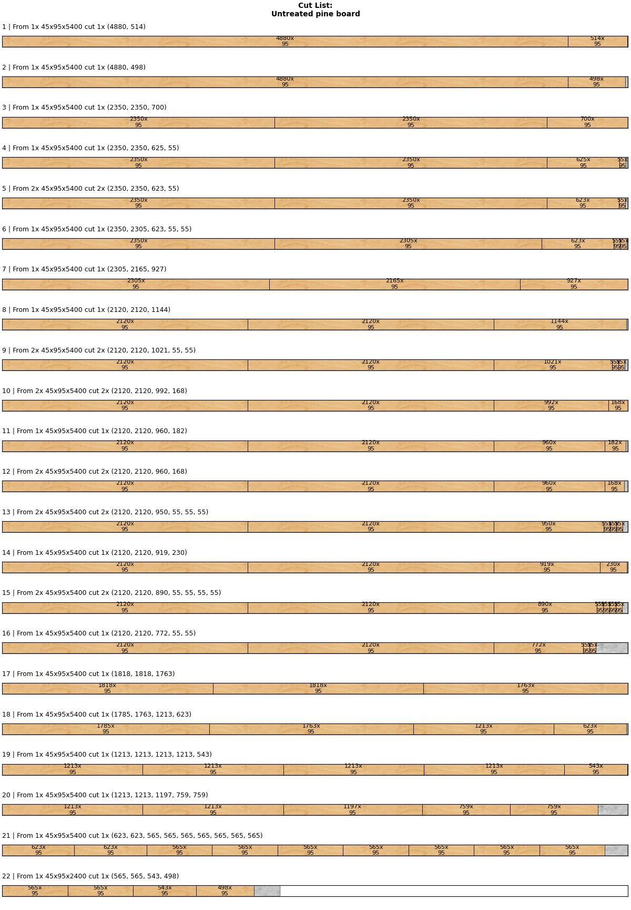</td>
        <td>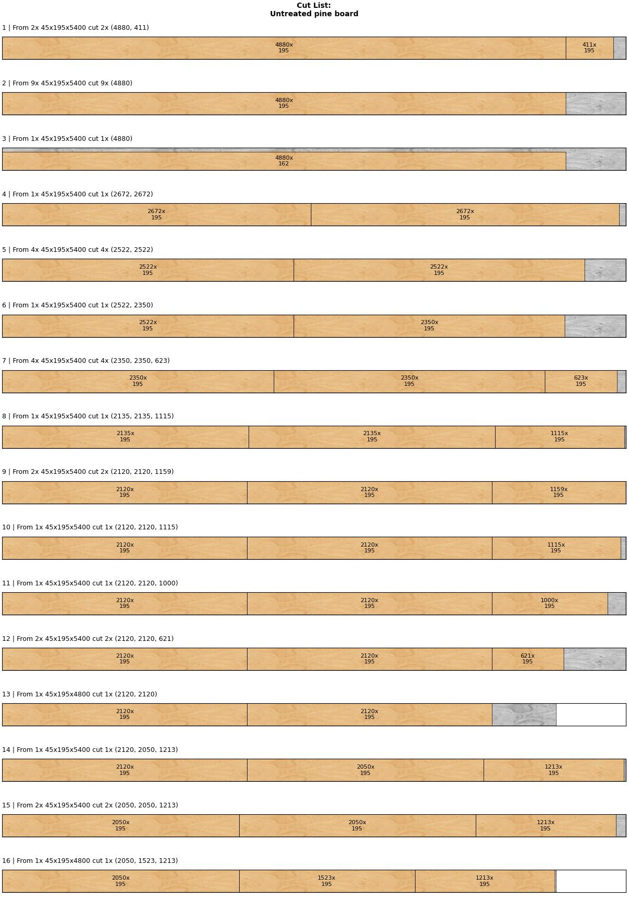</td>
    </tr><tr style="vertical-align:top">
        <td>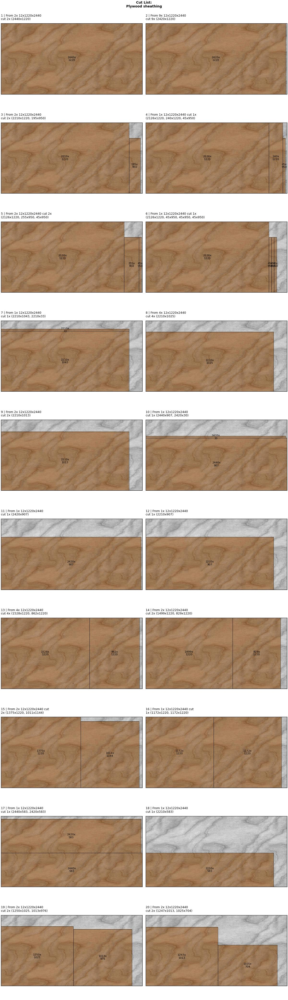</td>
        <td>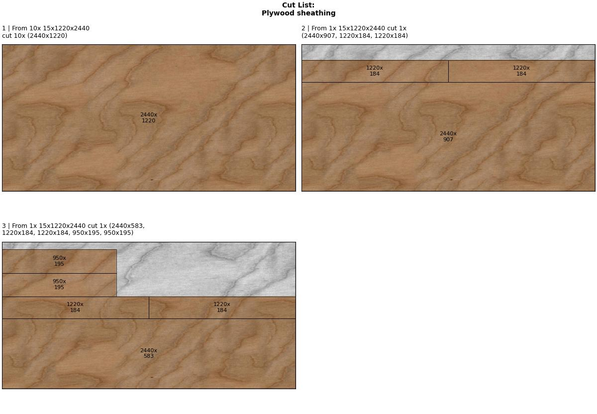</td>
        <td>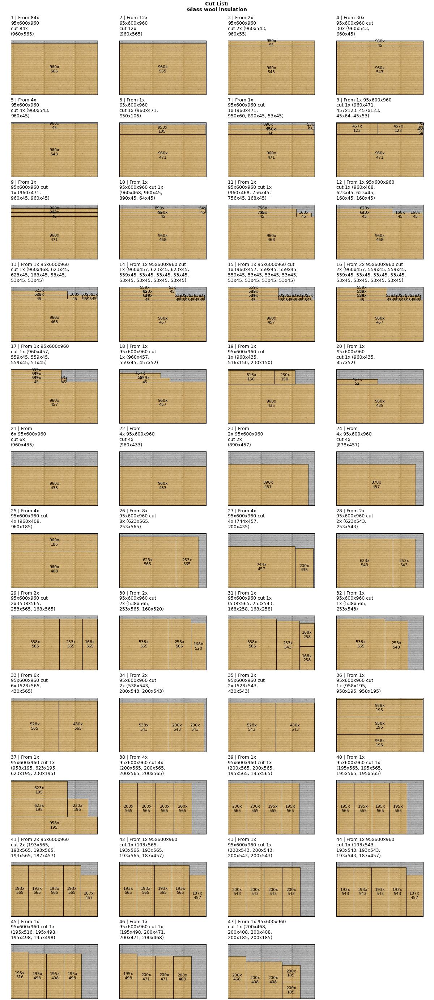</td>
    </tr></table>
</details><br>

```python
# Summarize findings, i.e. cost, volume, mass, stock utilization, etc.
plan.summarize(currency="dkk")
```

<details><summary>Output example</summary>

```
Summary:
--------
Required stock:
• 16 of 45x45x5400 untreated pine board
  63.43 dkk per 1 unit(s) at stark.dk
  Cost: 1014.88 dkk, Volume: 0.17 m³, Mass: 77.21 kg
  Utilization: 98.07%

• 1 of 45x45x4800 untreated pine board
  56.38 dkk per 1 unit(s) at stark.dk
  Cost: 56.38 dkk, Volume: 0.01 m³, Mass: 4.12 kg
  Utilization: 94.1%

• 27 of 45x95x5400 untreated pine board
  94.78 dkk per 1 unit(s) at stark.dk
  Cost: 2559.06 dkk, Volume: 0.62 m³, Mass: 278.13 kg
  Utilization: 99.16%

• 1 of 45x95x2400 untreated pine board
  33.48 dkk per 1 unit(s) at lavpristrae.dk
  Cost: 33.48 dkk, Volume: 0.01 m³, Mass: 4.18 kg
  Utilization: 90.46%

• 32 of 45x195x5400 untreated pine board
  177.93 dkk per 1 unit(s) at lavpristrae.dk
  Cost: 5693.76 dkk, Volume: 1.43 m³, Mass: 642.66 kg
  Utilization: 94.18%

• 2 of 45x195x4800 untreated pine board
  158.16 dkk per 1 unit(s) at lavpristrae.dk
  Cost: 316.32 dkk, Volume: 0.08 m³, Mass: 35.64 kg
  Utilization: 94.02%

• 42 of 12x1220x2440 plywood sheathing
  299.0 dkk per 1 unit(s) at jemogfix.dk
  Cost: 12558.0 dkk, Volume: 1.33 m³, Mass: 610.52 kg
  Utilization: 88.46%

• 12 of 15x1220x2440 plywood sheathing
  349.0 dkk per 1 unit(s) at jemogfix.dk
  Cost: 4188.0 dkk, Volume: 0.52 m³, Mass: 239.24 kg
  Utilization: 97.06%

• 22 10-packs of 95x600x960 glass wool insulation
  169.0 dkk per 10 unit(s) at jemogfix.dk
  Cost: 3718.0 dkk, Volume: 10.65 m³, Mass: 170.35 kg
  Utilization: 90.92%

Total stock volume: 16.17 m³
Total component volume: 14.81 m³

Total stock mass: 2212.44 kg
Total component mass: 2062.04 kg

Total utilization: 91.62%
Total cost: 30137.88 dkk
```

</details><br>

---
## Showcase <a name="showcase"></a>
The place where home models and their plans are displayed.

<details><summary><b>The Nano</b></summary>

### The Nano
A modular tiny home designed to be on wheels.


<table>
    <tr>
        <td></td>
        <td></td>
    </tr>
    <tr>
        <td></td>
        <td></td>
    </tr>
    <tr>
        <td></td>
        <td></td>
    </tr>
</table>
</details>

<details><summary><b>The Micro</b></summary>

### The Micro <a name="reference"></a>
This is a model designed **only to be a reference plan** for others that wish to contribute with their own plans. It serves to illustrate the idea of building a complete model as one would a real house, i.e. using discrete units of timber, fasteners, etc. It also serves to demonstrate how to organize the model using tags. [Model](reference/model.skp) | [Materials](reference/materials.ods)


<table>
    <tr>
        <td>
        Framing and inner sheathing.</td>
        <td>
        Outer sheathing.</td>
    </tr>
    <tr>
        <td>
        Thermal control layer (insulation).</td>
        <td>
        The 1st floor internal layout.</td>
    </tr>
    <tr>
        <td>
        The 2nd floor internal layout.</td>
        <td>
        Basic layouting of utilities.</td>
    </tr>
</table>
</details>

---
## Contribute
You can contribute in the following ways:
- Fork a starter and localize it to the commercial standards of your area.
- Use an existing starter to create full home models.
- Review existing models, opening issues, compile material lists, etc.
- Modify or modularize existing models.

All contributions are processed through pull-requests.
